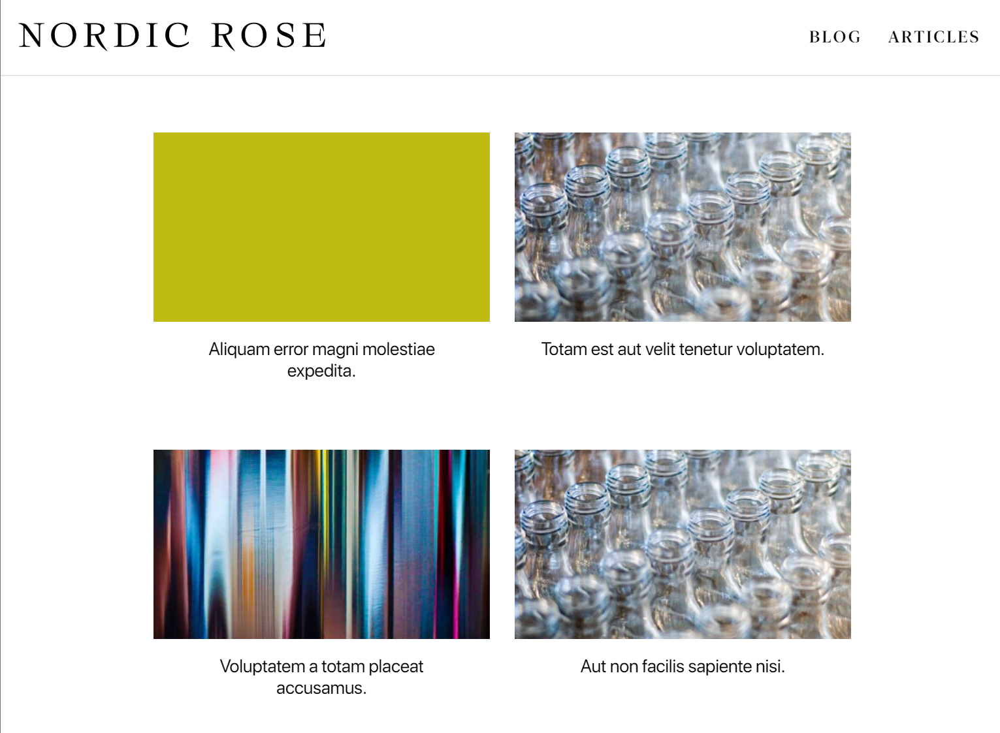
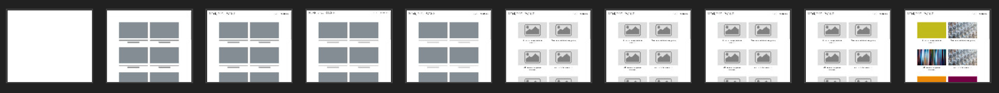
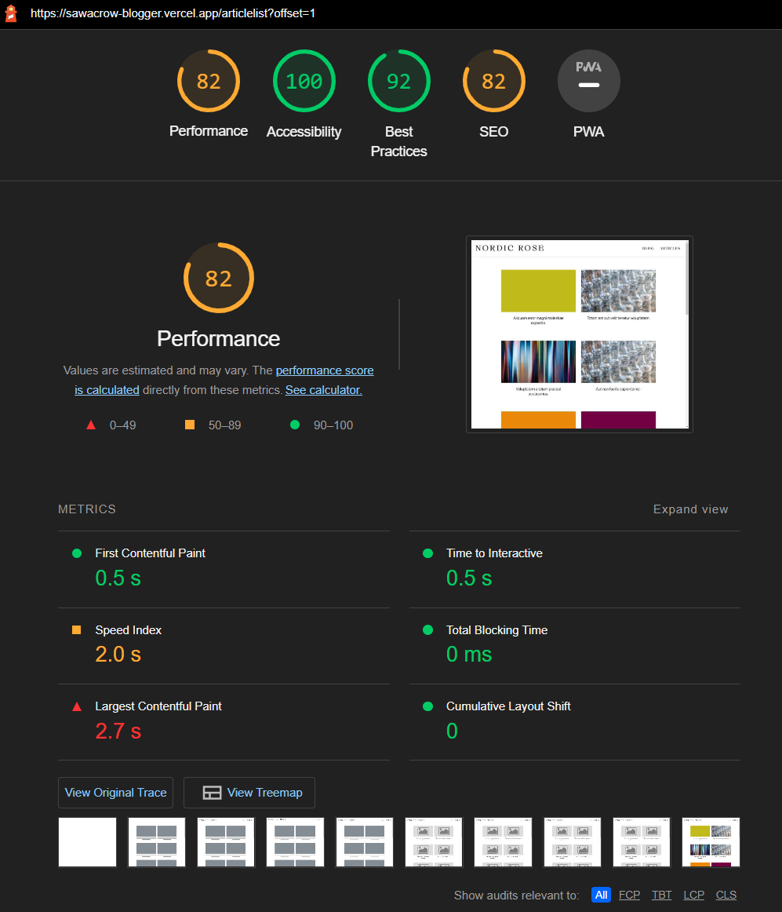

# Sawacrow Blogger V.1
 Sawacrow Blog Page
 
 TR: Wordpress API Server olarak kullanılıp, React.JS üzerinde farklı bir GUI ekranı tasarlandı.
 
 EN: A different GUI screen was designed on React.JS by using the Wordpress API Server.
 

Demo: https://sawacrow-blogger.vercel.app/   		

Figma Theme: https://www.figma.com/community/file/825069539366152961

Wordpress Resource Site: https://dummyblog.cengizilhan.com/ (Fetch Resource)

**Scripts & Frameworks:**
 - Hover.css ( CSS Library)
 - Axios
 - React Helmet ( Meta Description-Head Filler)
 - React Lazy Load 
 - Gsap (Animation Library)
 - Bootstrap 5.2
 - Wordpress Fetch API
 - React JS

Use React With Wordpress Headless CMS.resource
https://www.cloudways.com/blog/use-react-with-wordpress-to-create-headless-cms/
